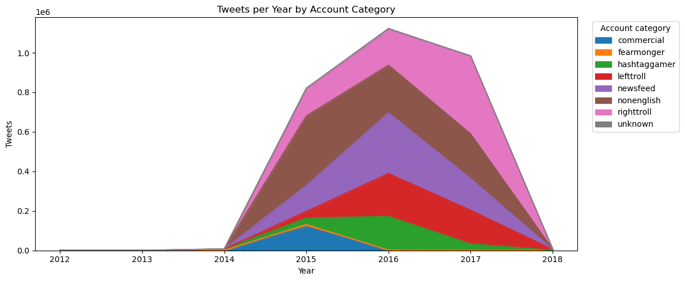
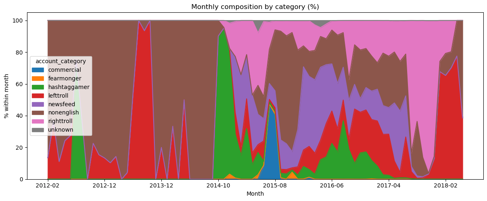
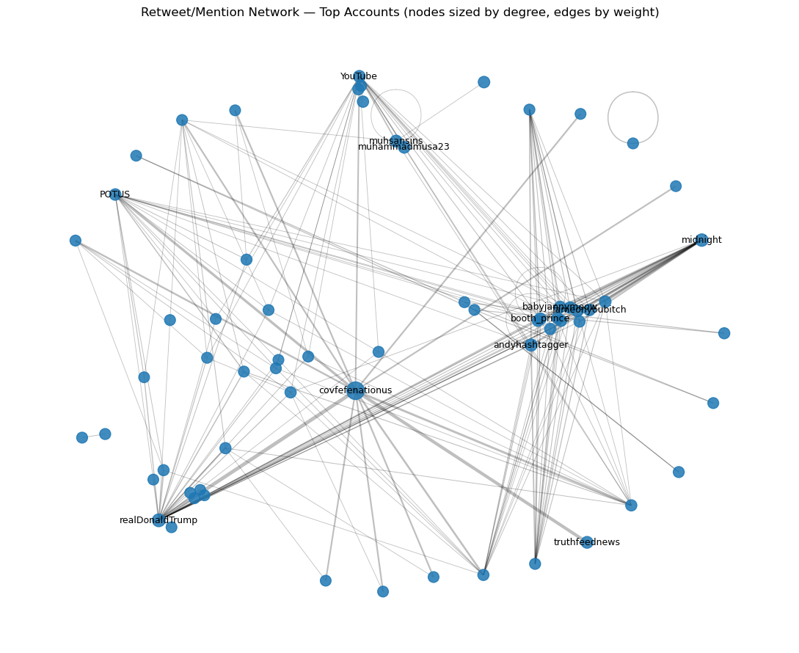
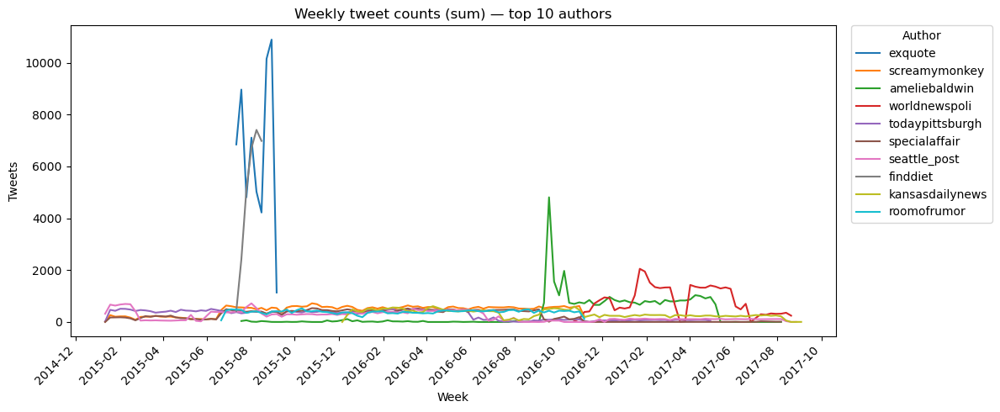

# Russian Troll Tweets Big Data Analysis (PySpark)

Large-scale data analysis project processing ~3 million tweets using PySpark, focusing on data engineering, text analytics, and network behaviour.
This project demonstrates the use of PySpark for large-scale social media analysis, combining data engineering, exploratory data analysis, and network-based insights.

## Project Highlights

- Processed ~3 million tweets using PySpark  
- Built an end-to-end data cleaning pipeline  
- Performed temporal, textual, and network analysis  
- Identified behavioural patterns across troll account categories  

## Overview

This project analyses nearly 3 million tweets linked to the Internet Research Agency (IRA), a Russian troll farm, using PySpark and Apache Spark.

The project focuses on large-scale data processing, data cleaning, and advanced analytical exploration of social media behaviour.

## Objectives

* Build a scalable data cleaning pipeline using PySpark
* Analyse temporal patterns in tweet activity
* Perform text and hashtag analysis
* Study retweet behaviour and interaction networks
* Compare behaviour across account categories

## Dataset

Source: https://github.com/fivethirtyeight/russian-troll-tweets/

The dataset contains tweets posted between 2012 and 2018 from accounts associated with the IRA.

## Tools & Technologies

* Python
* PySpark
* Apache Spark
* Pandas
* Matplotlib

## Project Structure

* `notebooks/01_data_cleaning_pipeline.ipynb` → Data preparation and cleaning
* `notebooks/02_full_analytical_report.ipynb` → Full analysis and insights

## Key Features

* Large-scale data processing (≈3 million records)
* Data cleaning pipeline (missing values, duplicates, schema fixes)
* Temporal analysis of tweet activity
* Text mining and hashtag analysis
* Network analysis of retweets
* Clustering and statistical analysis

## Key Insights

- Tweet activity increased significantly between 2015 and 2017, peaking around the 2016 US election period  
- Distinct account categories exhibited different behavioural roles and content strategies  
- Retweet structures suggest coordinated interaction patterns across specific accounts  
- Content varied depending on political alignment and account function

## Why This Project Matters

This project demonstrates how large-scale social media data can be processed and analysed to uncover behavioural patterns, coordinated activity, and content strategies, which are critical in domains such as misinformation detection and digital analytics.

* ## Example Outputs

### Tweets per Year by Account Category
Shows the evolution of tweet activity across different account categories, highlighting a strong increase between 2015 and 2017.

---

### Monthly Composition by Account Category (%)
Illustrates how the relative contribution of each account category changed over time, revealing shifts in content strategy.

---

### Retweet / Mention Network
Network representation of interactions between accounts, highlighting connectivity patterns and potential coordination structures.

---

### Weekly Tweet Activity — Top Authors
Displays activity patterns of the most active accounts, helping identify spikes and abnormal behaviour.

## How to Run

1. Install dependencies
2. Set up a Spark environment
3. Download dataset from the original source
4. Run notebooks in order

## Important Note

Some tweets contain links that may redirect to unsafe or inactive content. Use caution when accessing raw URLs.

## Author

Sara Silva
